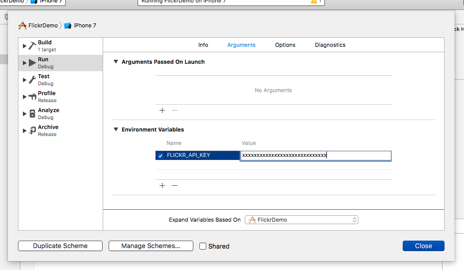

# Flickr Demo

- [The App Garden on Flickr](https://www.flickr.com/services/)

# Flickr API Key

The API requires API keys as well as another services, and also they shouldn't be opened for public. Here's a way to handle them secretly.

("Secret" key should be secret, on the other hand, actually, just "Key" don't have to be hidden usually.)

## Find or create keys

1. Log in and open "The App Garden": [https://www.flickr.com/services/](https://www.flickr.com/services/)
2. Follow the link "Apps By You" at **"Your Apps"** on right side.
3. You should see **the list of your apps**. If you haven't created anything, try **"Get Another Key"**.
4. Open your app's dashboard from **the app's name**
5. Click the link **"Admin → View"** on right side.
6. **"Key"** is the one. ("Secret" is another one.)

## Set environment variables

Open sheme settings by: FlickerDemo → Edit Scheme.


Find "Environment Variables" under Arguments. Push "+" button and add a variable for the key.



## Read the environment variables

```swift
let apiKey = ProcessInfo.processInfo.environment["FLICKR_API_KEY"]!
```

There you go. :)
