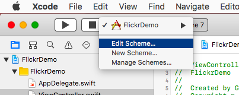

# Flickr Demo

- [The App Garden on Flickr](https://www.flickr.com/services/)

# Flickr API Key

The API requires API keys as well as another services, and also they shouldn't be opened for public. Here's a way to handle them secretly.

("Secret" key should be secret, on the other hand, actually, just "Key" don't have to be hidden usually.)

## Create keys

Open "The App Garden":

- [The App Garden on Flickr](https://www.flickr.com/services/)

1. Follow the link "Apps By You" at "Your Apps" on right side.
2. You should see the list of your app. If you haven't created anything, try "Get Another Key".
3. Open your app's dashboard from the name and click the link "Admin → View" on right side.
4. "Key" is the one. ("Secret" is another one.)

## Set environment variables

Open sheme settings by: FlickerDemo → Edit Scheme.



Find "Environment Variables" under Arguments.


Push "+" button and add a variable for the key.

## Read the environment variables

```swift
let apiKey = ProcessInfo.processInfo.environment["FLICKR_API_KEY"]!
```
